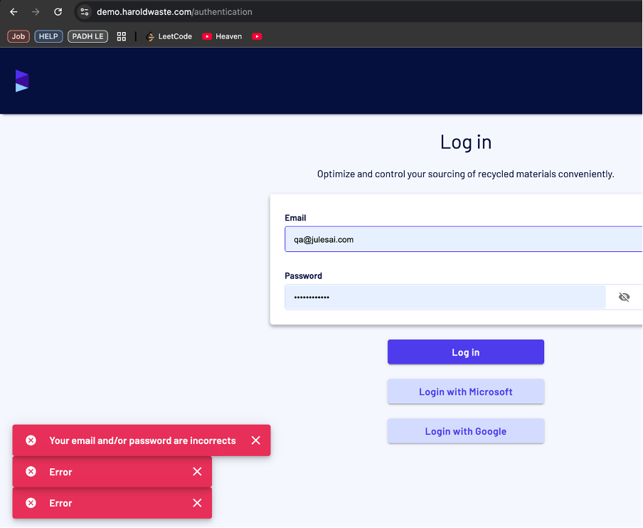

Bug Report 4: Gmail Authentication - Multiple Incorrect Error Messages
Bug Title: Gmail Authentication Shows Multiple Incorrect Error Messages
Steps to Reproduce:

1. Navigate to the login page: https://demo.haroldwaste.com/

2. Try to log in using Gmail authentication with an incorrect Gmail account.

3. Observe the error messages displayed.

Expected Behavior:

The system should display a single, clear error message indicating the problem.

Actual Behavior:

Multiple error messages are displayed, including some that are incorrect or irrelevant to the user's actions.

Severity: High

Impact Analysis:

Users: Multiple error messages can confuse the user and make it harder to understand the issue. This can be frustrating and cause users to abandon the login attempt.

Screenshot of Issue:
