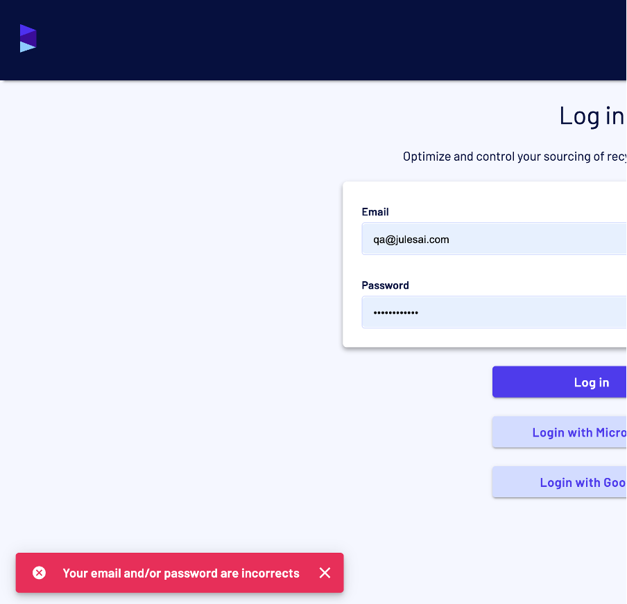

Bug Report 3: UI Issue - X Icon Not Clickable in Error Message
Bug Title: Error Message X Icon Not Clickable
Steps to Reproduce:

1. Go to the login page: https://demo.haroldwaste.com/

2. Enter incorrect login credentials (invalid email/password).

3. When the error message is displayed, attempt to close it by clicking the X icon on the error message.

Expected Behavior:

The X icon should be clickable and should close the error message when clicked.

Actual Behavior:

The X icon does not respond to clicks.

Severity: Low

Impact Analysis:

Users: Users are unable to dismiss the error message, which could lead to a poor user experience, especially in case of repeated login failures.

Screenshot of Issue:

